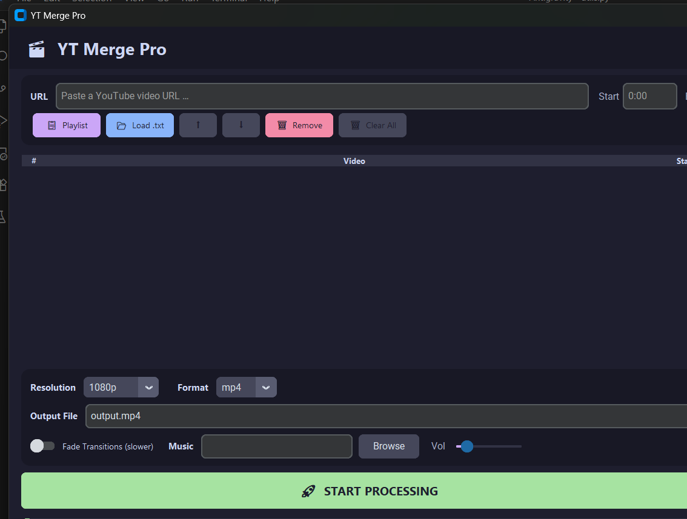

<div align="center">

# 🎬 YT Merge Pro

**A powerful desktop application to download, trim, and merge YouTube videos — with NVIDIA GPU acceleration.**

[](https://python.org)
[](https://ffmpeg.org)
[](LICENSE)
[]()

<br/>

> Download multiple YouTube videos, trim specific segments, and merge them into a single polished file — all from a sleek dark-themed GUI.

</div>

---

## ✨ Features

| Feature | Description |
|:--------|:------------|
| 🎥 **Download & Merge** | Download multiple YouTube videos and combine them into one file |
| ⚡ **GPU Accelerated** | Auto-detects NVIDIA GPUs and uses `h264_nvenc` for blazing-fast encoding |
| 📋 **Playlist Import** | Import full playlists, filter by keyword, and cherry-pick videos |
| ✂️ **Trim Clips** | Set start and end timestamps on any video |
| 🔗 **Smart Merge** | Fast concat (no re-encode) by default — crossfade transitions optional |
| 🎵 **Background Music** | Overlay audio tracks with adjustable volume |
| 📂 **Batch Import** | Load URLs from a `.txt` file for bulk processing |
| 💾 **Smart Cache** | Skips re-downloading and re-processing videos already cached |
| 🔄 **Auto Retry** | Retries failed downloads (3 attempts with exponential backoff) |
| 📊 **Live Progress** | Per-video download speed and overall pipeline progress tracking |
| 🎨 **Modern Dark UI** | CustomTkinter with a polished Catppuccin Mocha color scheme |

---

## 📸 Screenshots

<div align="center">

> Screenshots coming soon — the app features a modern dark-themed interface with a clean layout.

<!-- 


-->

</div>

---

## 📁 Project Structure

```
yt_merge/
├── main.py                    # Application entry point
├── requirements.txt           # Python dependencies
├── README.md
├── LICENSE
├── CONTRIBUTING.md
├── CHANGELOG.md
├── .gitignore
│
└── yt_merge/                  # Core package
    ├── __init__.py
    ├── config.py              # Hardware detection, settings, constants
    ├── models.py              # VideoEntry dataclass, VideoStatus enum
    ├── utils.py               # Timestamps, file helpers, URL parsing
    ├── downloader.py          # yt-dlp wrapper (progress, retry, cache)
    ├── processor.py           # FFmpeg normalization (trim, scale, fps)
    ├── engine.py              # Pipeline orchestrator (download → process → merge)
    │
    └── gui/                   # GUI layer
        ├── __init__.py
        ├── app.py             # Main application window
        ├── components.py      # VideoQueue, LogViewer, ProgressPanel
        ├── playlist_dialog.py # Playlist import with keyword filter
        └── settings_panel.py  # Resolution, format, transitions, music
```

---

## 🚀 Getting Started

### Prerequisites

| Requirement | Version | Notes |
|:------------|:--------|:------|
| **Python** | 3.9+ | [Download](https://python.org/downloads/) |
| **FFmpeg** | Latest | [Download](https://ffmpeg.org/download.html) — must be on `PATH` |
| **NVIDIA GPU** | Optional | Automatically detected for hardware acceleration |

### Step 1 — Clone the Repository

```bash
git clone https://github.com/YOUR_USERNAME/yt-merge-pro.git
cd yt-merge-pro
```

### Step 2 — Install Dependencies

```bash
pip install -r requirements.txt
```

### Step 3 — Install FFmpeg

<details>
<summary><strong>Windows</strong></summary>

1. Download from [ffmpeg.org](https://ffmpeg.org/download.html) or install via:
   ```
   winget install FFmpeg
   ```
2. Add the `bin/` folder to your system `PATH`
3. Verify: `ffmpeg -version`
</details>

<details>
<summary><strong>macOS</strong></summary>

```bash
brew install ffmpeg
```
</details>

<details>
<summary><strong>Linux (Ubuntu/Debian)</strong></summary>

```bash
sudo apt update && sudo apt install ffmpeg
```
</details>

### Step 4 — Run the Application

```bash
python main.py
```

---

## 📖 Usage Guide

### Adding Videos

1. **Single URL** — Paste a YouTube URL in the input field, optionally set Start/End times, click **Add**
2. **Playlist** — Click **Playlist**, paste a playlist URL, fetch metadata, filter and select videos
3. **Batch File** — Click **Load .txt** to import URLs from a text file

### Batch File Format (`urls.txt`)

```text
# Lines starting with # are comments
https://www.youtube.com/watch?v=VIDEO_ID_1
https://www.youtube.com/watch?v=VIDEO_ID_2  0:30  1:45
https://youtu.be/VIDEO_ID_3  10  60
```

Format: `URL` or `URL  START  END` (space/tab separated)

### Processing

1. Configure output settings (resolution, format, transitions, music)
2. Click **Start Processing**
3. The pipeline runs: **Download → Normalize → Merge**
4. Output file is saved to the path you specified

---

## ⚡ Performance Notes

### GPU Acceleration

YT Merge Pro **automatically detects** NVIDIA GPUs at startup:

| Scenario | Encoder | Expected Speed |
|:---------|:--------|:---------------|
| NVIDIA GPU detected | `h264_nvenc` | 5–10x faster encoding |
| No GPU / non-NVIDIA | `libx264` (CPU) | Standard speed |

The detected encoder is shown in the header badge:
- 🟢 **Green badge** = GPU acceleration active
- 🟡 **Yellow badge** = CPU fallback

### Smart Caching

Downloaded and processed files are cached in `%LOCALAPPDATA%/YTMergePro/cache`. Re-running with the same videos skips redundant work.

### Merge Modes

| Mode | Speed | Quality | When Used |
|:-----|:------|:--------|:----------|
| **Fast Concat** | Very fast (copy) | Lossless | Default — no transitions |
| **Crossfade** | Slower (re-encode) | Smooth transitions | When "Fade Transitions" is enabled |

---

## 🖥️ Building a Standalone EXE

### Basic Build

```bash
pip install pyinstaller

pyinstaller --noconfirm --onefile --windowed ^
    --name "YTMergePro" ^
    --add-data "yt_merge;yt_merge" ^
    --hidden-import customtkinter ^
    --hidden-import yt_dlp ^
    --collect-all customtkinter ^
    main.py
```

The executable will be created in the `dist/` folder.

### Tips

- **Reduce EXE size** — Use `--exclude-module matplotlib --exclude-module numpy` to drop unused modules
- **Include FFmpeg** — Bundle `ffmpeg.exe` and `ffprobe.exe` alongside the EXE, or instruct users to install it separately
- **UPX compression** — Install [UPX](https://upx.github.io/) and PyInstaller will use it automatically to compress the binary

> **Note:** FFmpeg is an external dependency and must be available on the system `PATH` (or placed next to the EXE).

---

## ❓ FAQ

<details>
<summary><strong>Q: The app says "ffmpeg NOT FOUND" — what do I do?</strong></summary>

Download FFmpeg from [ffmpeg.org](https://ffmpeg.org/download.html) and add its `bin/` directory to your system PATH. Restart your terminal after updating PATH.
</details>

<details>
<summary><strong>Q: Does this work without an NVIDIA GPU?</strong></summary>

Yes! The app automatically falls back to CPU encoding (`libx264`). GPU acceleration is optional and only speeds up the encoding step.
</details>

<details>
<summary><strong>Q: Where are cached files stored?</strong></summary>

On Windows: `%LOCALAPPDATA%\YTMergePro\cache`  
On Linux/macOS: `~/.YTMergePro/cache`  

You can safely delete this folder to reclaim disk space.
</details>

<details>
<summary><strong>Q: Can I download private or age-restricted videos?</strong></summary>

This depends on yt-dlp's capabilities. You may need to provide cookies. See the [yt-dlp documentation](https://github.com/yt-dlp/yt-dlp#cookies) for details.
</details>

<details>
<summary><strong>Q: What formats are supported?</strong></summary>

Output formats: **MP4** and **MKV**. Input is handled by yt-dlp, which supports virtually all YouTube formats.
</details>

---

## 🗺️ Roadmap

Future features under consideration:

- [ ] 🖼️ **Thumbnail preview** for each video in the queue
- [ ] 🔀 **Drag-and-drop reordering** of videos
- [ ] ⏸️ **Pause / Resume** per video and globally
- [ ] 🎬 **Intro / Outro clips** — prepend or append custom video segments
- [ ] 📝 **Subtitle support** — download and burn subtitles into video
- [ ] 🔊 **Audio normalization** — even out volume levels across clips
- [ ] 🎵 **Fade in/out** for background music
- [ ] 🌐 **Multi-language UI**
- [ ] 📱 **URL drag-and-drop** from browser

---

## 🤝 Contributing

Contributions are welcome! Please read the [Contributing Guide](CONTRIBUTING.md) before submitting a pull request.

---

## 📄 License

This project is licensed under the **MIT License** — see the [LICENSE](LICENSE) file for details.

---

<div align="center">

**Built with ❤️ using Python, yt-dlp, FFmpeg, and CustomTkinter**

⭐ Star this repo if you found it useful!

</div>
